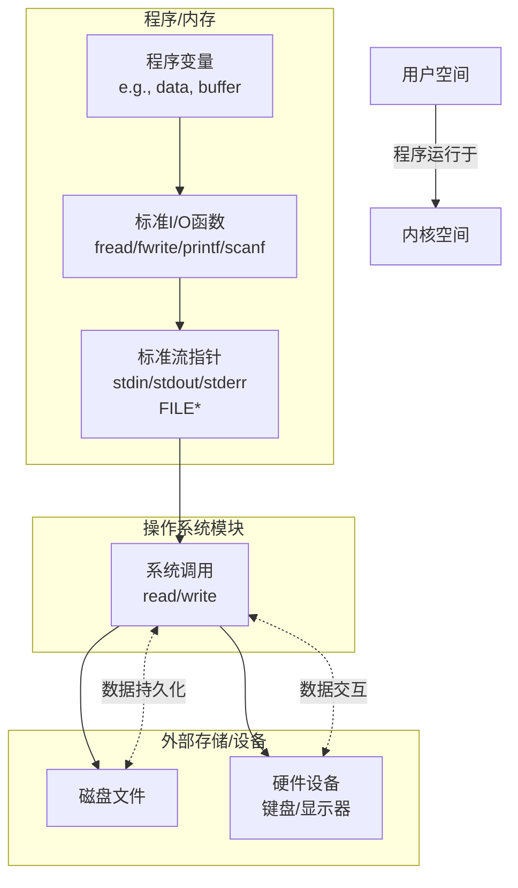

# C语言知识点 · 文件篇

## 答疑：

### 1、feof函数判断到达文件结束的时机是什么时候？

```c
while (feof(fp)!=EOF){
    ch=fgetc();
}
```

**为何上述代码会导致多读取一个根本不存在的字符**？

​	问题的核心在于对 `feof`函数工作原理的误解。简单来说，**`feof`不会预测下一次读取是否会到达文件尾，它只报告上一次读取操作是否已经触发了文件结束标志**。

​	下面这个表格清晰地展示了你在代码中 `while(!feof(fp))`循环的实际执行过程，以及问题是如何产生的。

| 循环次数      | `feof(fp)`值（循环条件） | `fgetc(fp)`的读取行为与返回值          | 循环体是否执行 | 现象说明                                  |
| ------------- | ------------------------ | -------------------------------------- | -------------- | ----------------------------------------- |
| 第 1 次       | 0 (假)                   | 成功读取**第 1 个**字符                | 是             | 正常读取                                  |
| ...           | ...                      | ...                                    | 是             | ...                                       |
| 第 N 次       | 0 (假)                   | 成功读取**最后 1 个**字符              | 是             | 正常读取最后一个有效字符                  |
| **第 N+1 次** | **0 (假)**               | **尝试读取下一个字符失败，返回 `EOF`** | **是**         | **多读一次，读取到不存在的字符（`EOF`）** |
| 第 N+2 次     | 非零 (真)                | -                                      | 否             | 循环结束                                  |

**问题的根源与正确做法**

​	从表格可以看出，问题出在 **判断逻辑的顺序** 上。你的代码逻辑是“先判断是否结束，再读取”，而正确的逻辑应该是“**先读取，再判断这次读取是否成功**”。

​	`feof`函数检测的是一个“文件结束标志位”，这个标志位只有在进行一次失败的读取操作（即试图读取文件末尾之后的数据）后才会被设置 。在你读取最后一个有效字符时，文件指针确实到达了末尾，但这次读取操作本身是*成功*的，所以 `feof`依然返回0。直到下一次 `fgetc`尝试读取时，才发现无数据可读，此时才设置结束标志位并返回 `EOF`。

因此，最可靠和推荐的做法是**直接使用读取函数的返回值作为循环条件**。

**正确的代码示例**

```c
int ch; // 必须使用 int 类型来接收 fgetc 的返回值，以便正确容纳 EOF
while ((ch = fgetc(fp)) != EOF) {
    putchar(ch);
}
```

​	这种写法的好处是：

1. **即时判断**：在读取操作完成后立刻判断其是否有效。
2. **避免滞后**：完美规避了 `feof`的“滞后性”问题 。
3. **通用性**：此模式适用于大多数文件读取函数（如 `fgets`判断是否返回 `NULL`，`fread`判断返回值是否小于预期等）。

#### **feof的正确用途** ####

​	那么 `feof`应该在什么时候使用呢？它的主要作用是**在读取操作失败后，帮助区分失败的原因**：到底是因为正常到达文件末尾，还是因为发生了其他错误 。

```c
// 示例：结合 fgetc 和 feof/ferror 进行健壮的错误处理
int ch;
while ((ch = fgetc(fp)) != EOF) {
    // 处理数据
}

// 循环结束后，判断是什么原因退出的
if (feof(fp)) {
    printf("文件已正常读取完毕。\n");
} else if (ferror(fp)) {
    printf("在读取过程中发生了错误。\n");
}
```


### 2、二进制文件名不能用.txt作为扩展名，否则二进制文件读写函数fread和fwrite将出错？

​	你提到的这个说法是**不正确**的。文件的扩展名（如 `.txt`）并不会直接影响 `fread`和 `fwrite`函数的功能。问题的核心在于你用何种 **“模式”** 打开文件，而不是文件叫什么名字。

| 特性维度     | 文本模式                                                     | 二进制模式                                                   |
| ------------ | ------------------------------------------------------------ | ------------------------------------------------------------ |
| **打开方式** | 使用 `"r"`, `"w"`, `"a"`                                     | 使用 `"rb"`, `"wb"`, `"ab"`                                  |
| **数据处理** | 会对换行符 `\n`和 `\r\n`进行转换                             | **原样**读写，不做任何转换                                   |
| **适用场景** | 纯文本文件（如 `.txt`, `.c`）                                | 所有非纯文本文件（如图片、音频、视频、可执行文件、数据存档等） |
| **系统差异** | 在 Windows 上行为与二进制模式不同，在类 Unix 系统（如 Linux）上两者无区别 | 在所有操作系统上行为一致                                     |

#### **扩展名只是约定** ####

​	文件扩展名（如 `.txt`, `.dat`, `.jpg`）仅仅是给操作系统和用户看的**标签**，用于快速识别文件类型。它**不会**影响 `fread`/`fwrite`的行为。你可以把一个图像文件命名为 `picture.txt`，但只要你用 `"rb"`模式正确打开，依然能正常读取它的二进制数据。


### 3、常用文件操作函数的速查指南。

| 函数名        | 功能描述                   | 基本使用格式                   | 返回值                                      |
| ------------- | -------------------------- | ------------------------------ | ------------------------------------------- |
| **`fprintf`** | 格式化写入文件             | `fprintf(fp, "格式", 变量...)` | 成功写入的字符数，出错为负                  |
| **`fscanf`**  | 从文件格式化读取           | `fscanf(fp, "格式", &变量...)` | 成功读取的数据项数，失败或文件尾为EOF       |
| **`feof`**    | 检测文件结束标志           | `feof(fp)`                     | 未到文件尾为0，已到文件尾为非零             |
| **`ftell`**   | 获取当前文件位置           | `ftell(fp)`                    | 成功返回当前位置距文件头的字节数，出错为-1L |
| **`fseek`**   | 移动文件位置指针           | `fseek(fp, 偏移量, 起始点)`    | 成功为0，出错非0                            |
| **`rewind`**  | 将文件位置指针重置到文件头 | `rewind(fp)`                   | 无返回值                                    |
| **`fgetc`**   | 从文件读取一个字符         | `fgetc(fp)`                    | 成功返回读取的字符，失败或文件尾为EOF       |
| **`fgets`**   | 从文件读取一行字符串       | `fgets(str, n, fp)`            | 成功返回`str`，失败或文件尾返回NULL         |
| **`fputc`**   | 向文件写入一个字符         | `fputc(ch, fp)`                | 成功返回写入的字符，失败为EOF               |
| **`fputs`**   | 向文件写入一个字符串       | `fputs(str, fp)`               | 成功返回非负值，失败为EOF                   |

#### 💡 注意事项 ####

- **`fprintf`与 `fscanf`**：这是用于文件格式化输入输出的核心函数。`fprintf`的格式字符串与 `printf`完全相同。使用 `fscanf`时，**务必检查其返回值**，以确定成功读取了多少个数据项，这是避免读取逻辑错误的关键。要确保格式字符串中的转换说明符（如`%d`, `%s`）与后续变量参数的类型严格匹配。
- **`feof`的使用误区**：`feof`只有在**已经尝试读取并越过文件末尾后**才会返回真。因此，它通常用于判断上一次读取操作失败的原因是否是文件结束，而不应用作循环条件来决定是否开始读取。更安全的做法是直接检查读取函数（如 `fgetc`, `fgets`, `fscanf`）的返回值。
- **`fseek`与 `ftell`**：这两个函数常用于实现文件的随机访问。`fseek`的“起始点”有三个预定义常量：`SEEK_SET`（文件头）、`SEEK_CUR`（当前位置）、`SEEK_END`（文件尾）。`ftell`返回的是当前指针位置相对于文件开头的**字节偏移量**，这对于计算文件大小等操作很有用。
- **`rewind`的等效操作**：`rewind(fp)`功能上完全等价于 `fseek(fp, 0L, SEEK_SET)`，区别在于 `rewind`会同时清除文件的结束标志和错误标志。
- **`fgets`的读取行为**：`fgets`会读取包括换行符 `\n`在内的字符，并在字符串末尾自动添加空字符 `\0`。它最多读取 **n-1** 个字符，为 `\0`预留空间。如果一行字符数超过 n-1，下次调用会继续读取剩余部分。
- **`fputc`与 `fputs`**：`fputc`用于写入单个字符。`fputs`用于写入字符串，但**不会**自动在写入的字符串末尾添加换行符 `\n`，如果需要换行，必须显式写入。

#### 💎 通用最佳实践 ####

1. **错误检查**：所有文件操作函数（特别是 `fopen`）调用后都应检查是否成功。忽略返回值是常见的错误来源。
2. **资源管理**：使用 `fopen`打开文件后，务必在操作结束时使用 `fclose`关闭文件，以避免资源泄漏。
3. **模式选择**：根据需求正确选择文件打开模式（如 `"r"`, `"w"`, `"a"`, `"rb"`等），尤其是在处理二进制文件时，务必使用包含 `b`的模式（如`"wb"`, `"rb"`）。


### 4、r,r+,w,w+,a,a+六种模式的所有的异同。

​	理解并正确使用 `fopen`的不同模式是文件操作的关键。下面这个表格清晰地梳理了 `r`, `r+`, `w`, `w+`, `a`, `a+`这六种模式的核心区别。

| 模式     | 文件必须存在？ | 是否清空原内容？ | 读权限 | 写权限 | 初始文件指针位置                | 写入位置特性                          |
| -------- | -------------- | ---------------- | ------ | ------ | ------------------------------- | ------------------------------------- |
| **`r`**  | 是             | 否               | ✅      | ❌      | 文件开头                        | 不可写                                |
| **`r+`** | 是             | 否               | ✅      | ✅      | 文件开头                        | 可覆盖任意位置                        |
| **`w`**  | 否             | 是               | ❌      | ✅      | 文件开头                        | 总是从头写入，并先清空文件            |
| **`w+`** | 否             | 是               | ✅      | ✅      | 文件开头                        | 总是从头写入，并先清空文件            |
| **`a`**  | 否             | 否               | ❌      | ✅      | **文件末尾**                    | **总是追加**到末尾，无视`fseek`       |
| **`a+`** | 否             | 否               | ✅      | ✅      | 文件开头（读） / 文件末尾（写） | **写操作总是追加**到末尾，无视`fseek` |

**核心解读与使用建议**

- **理解“+”号的作用**：`r+`, `w+`, `a+`都是在基础模式上增加了读写双重权限。但需要注意的是，它们并非简单地叠加功能，基础行为（如是否清空文件）仍由 `r`, `w`, `a`决定。
- **`a`/`a+`的追加特性**：这是最容易产生困惑的地方。在这两种模式下，**所有写入操作都会强制在文件末尾进行**。**即使你使用 `fseek`将文件指针移动到文件中间，一旦执行写入，指针会自动跳回末尾。**这是“追加”模式的本质所决定的，适用于日志记录等场景。
- **`r+`与 `w+`的根本区别**：两者都允许读写，关键区别在于文件已存在时的行为。`w+`会**无条件清空**现有文件内容，而 `r+`会**保留**原内容。因此，如果你需要修改或更新一个已存在的文件，`r+`通常是更安全的选择。
- **模式选择指南** **仅读取内容**：使用 `r`。 **创建新文件或覆盖重写**：使用 `w`或 `w+`（如果需要后续读取）。 **在文件尾部添加内容（日志记录）**：使用 `a`或 `a+`（如果还需要读取之前的内容）。 **修改现有文件内容（随机读写）**：**这是 `r+`的主场**。你可以自由移动文件指针，覆盖指定位置的内容。

**重要注意事项**

1. **文本与二进制模式**：以上讨论均基于文本模式。若处理二进制文件（如图片、视频），应在模式后添加 `b`（如 `"rb+"`, `"wb"`），这在Windows系统下尤为重要，可避免换行符被自动转换。
2. **读写切换时的指针管理**：在使用 `r+`, `w+`, `a+`这些可读可写的模式时，在读取操作和写入操作之间切换，通常需要调用 `fseek`或 `rewind`来重新定位文件指针，以确保后续操作发生在预期位置。
3. **错误检查**：无论使用哪种模式，打开文件后都必须检查 `FILE*`指针是否为 `NULL`，这是保证程序健壮性的第一步。


### 5、关于文件指针,以下说法错误的是（	） ###

**A.一个文件指针变量只能对应一个文件**
**B.一个文件指针变量可以对应多个文件**
**C.文件指针变量指向了文件缓冲区**
**D.文件指针变量指向了外部存储区**

| 选项                                | 正误     | 简要分析                                                     |
| ----------------------------------- | -------- | ------------------------------------------------------------ |
| A. 一个文件指针变量只能对应一个文件 | **正确** | 一个文件指针变量在某一时刻只能指向一个由`fopen`打开的文件。  |
| B. 一个文件指针变量可以对应多个文件 | **错误** | 文件指针变量需要与文件一一对应，一个指针不能同时指向多个文件。 |
| C. 文件指针变量指向了文件缓冲区     | **正确** | 文件指针指向的`FILE`结构体包含了管理文件缓冲区的信息。       |
| D. 文件指针变量指向了外部存储区     | **错误** | 文件指针指向的是内存中的`FILE`结构体，而非磁盘等外部存储区上的文件本身。 |

#### 文件指针的工作原理 ####

1. **打开文件**：当你使用 `fopen`函数成功打开一个文件时，系统会在内存中创建一个 `FILE`结构体变量。这个结构体里记录了这个文件的所有状态信息，比如文件当前的读写位置、错误指示器，以及一个非常重要的部分——**文件缓冲区**的管理信息。
2. **指针的指向**：`fopen`函数返回的指针，正是指向这个内存中的 `FILE`结构体变量。因此，选项C的说法是正确的。我们通过这个指针来调用各种文件操作函数（如 `fread`, `fwrite`），这些函数再根据 `FILE`结构体中的信息，去操作内存中的缓冲区，并在适当的时候（如缓冲区满、调用 `fflush`或 `fclose`）由系统将缓冲区数据同步到磁盘上的文件里。
3. **一一对应**：每次调用 `fopen`打开一个文件，就会创建一个新的 `FILE`结构体和与之关联的缓冲区。所以，一个指针变量在某个时刻只能与一个文件相关联。如果你想同时操作多个文件，就需要定义多个文件指针变量，让它们分别指向不同的 `FILE`结构体。因此，选项A正确，选项B错误。
4. **关闭文件**：当调用 `fclose`关闭文件后，文件指针与那个文件（及其`FILE`结构体）的关联就解除了，此时这个指针就不再有效，不能用于文件操作。


### 6、（追问）对文件进行操作时，相关的数据流动路径。



#### 📥 读取数据（文件/设备 → 程序） ####

​	当你执行读取操作（如 `fread`、`fgetc`或 `scanf`）时，数据按以下路径流动：

1. **外部存储 → 内核缓冲区**：操作系统收到读取请求，由文件系统定位文件数据在磁盘上的具体位置（如通过inode找到数据块指针），然后将数据从磁盘读入**内核空间的缓冲区**。这一步涉及昂贵的磁盘I/O，系统会尽可能多读（如一次读4KB）。
2. **内核缓冲区 → 用户缓冲区（Stdio Buffer）**：数据从内核缓冲区拷贝到你所操作的文件流（由 `FILE *`指针标识）关联的**用户空间缓冲区**。C标准库的I/O函数管理着这个缓冲区。
3. **用户缓冲区 → 程序变量**：你调用的I/O函数（如 `fread`）最终从用户缓冲区中将数据拷贝到你所指定的**程序变量**（如字符数组、结构体）中。

​	对于**标准输入（`stdin`）**，数据源头是键盘而非磁盘，但路径相似：键盘输入 → 内核缓冲区 → `stdin`的用户缓冲区 → 程序变量。这个过程的核心是**缓冲（Buffering）**，它能有效减少直接读写磁盘的次数，从而大幅提升I/O效率。

#### 📤 写入数据（程序 → 文件/设备） ####

​	写入操作（如 `fwrite`、`fprintf`或 `printf`）是读取的逆过程，数据流动方向相反：

1. **程序变量 → 用户缓冲区**：你调用I/O函数，数据先从程序变量拷贝到对应的用户缓冲区。
2. **用户缓冲区 → 内核缓冲区**：当用户缓冲区满、你主动调用 `fflush()`或正常关闭文件（`fclose`）时，数据才会从用户缓冲区写入**内核缓冲区**。
3. **内核缓冲区 → 外部存储**：操作系统在适当时候（如缓冲区满、定时刷新）将数据从内核缓冲区**同步**到物理磁盘或输出到显示器等设备。

​	对于**标准输出（`stdout`）和标准错误（`stderr）**，数据最终的目的地是显示器。


### 7、fgets(s,n,fp);语句最多读取几个字符？

​	`fgets(s, n, fp);`语句最多会读取 **n-1 个字符** 到字符串 `s`中。

| 情况说明                    | 读取行为                | 存入 `s`的内容           | 自动添加          |
| --------------------------- | ----------------------- | ------------------------ | ----------------- |
| **一般情况**                | 最多读取 **n-1** 个字符 | 读取的字符（包括换行符） | 字符串结束符 `\0` |
| **提前遇到换行符（`\n`）**  | 读取到换行符时停止      | 包括换行符在内的所有字符 | 字符串结束符 `\0` |
| **提前遇到文件结尾（EOF）** | 读取到文件结尾时停止    | 已读取的所有字符         | 字符串结束符 `\0` |

- **为何是 n-1？** ==这是为了给字符串的结束标志 **空字符（`\0`）** 预留空间==。函数总会保证在有效字符之后自动加上这个 `\0`，使你得到的 `s`是一个完整的C语言字符串。
- **换行符的处理**：`fgets`会读取并保留换行符。如果你不希望字符串末尾包含换行符，可以手动将其替换为空字符，例如：`s[strcspn(s, "\n")] = 0;`。
- **返回值判断**：调用 `fgets`后，应检查其返回值。成功时返回指针 `s`，失败或到达文件末尾则返回 `NULL`。更安全的文件读取循环写法是 `while (fgets(s, n, fp) != NULL)`，而非 `while (!feof(fp))`。


### 8、fread与fwrite函数的使用格式与注意事项。

​	`fread`和 `fwrite`是C语言中用于**二进制文件**批量数据读写的核心函数。

| 特性              | `fread`                                                      | `fwrite`                                                     |
| ----------------- | ------------------------------------------------------------ | ------------------------------------------------------------ |
| **核心功能**      | 从文件读取数据块到内存                                       | 将内存中的数据块写入文件                                     |
| **函数原型**      | `size_t fread(void *ptr, size_t size, size_t count, FILE *stream)` | `size_t fwrite(const void *ptr, size_t size, size_t count, FILE *stream)` |
| **参数 `ptr`**    | 指向存放数据的内存地址（如数组首地址）                       | 指向要写入文件的数据源地址                                   |
| **参数 `size`**   | 每个数据元素的字节大小（常用 `sizeof(...)`）                 | 每个数据元素的字节大小（常用 `sizeof(...)`）                 |
| **参数 `count`**  | 希望读取的元素个数                                           | 希望写入的元素个数                                           |
| **参数 `stream`** | 已打开的文件指针（用 `"rb"`模式）                            | 已打开的文件指针（用 `"wb"`等模式）                          |
| **返回值**        | **成功读取**的元素个数（非字节数）                           | **成功写入**的元素个数（非字节数）                           |

💡 **关键参数与返回值解读**

- **参数 `size`和 `count`**：它们共同决定了此次读写操作的总字节数（总字节数 = `size * count`）。虽然你可以灵活设置，但一个清晰易懂的惯例是：**将 `size`设置为单个数据元素（如一个结构体、一个int变量）的大小，将 `count`设置为要读写的元素个数。** 例如，读写一个包含10个整数的数组时，设置 `size`为 `sizeof(int)`，`count`为 10，这样返回值就直接表示成功的整数个数，非常直观 。
- **返回值的意义**：这是最需要关注的地方。函数返回的是**成功读写的元素个数**，而不是字节数。 对于 `fwrite`，如果返回值小于 `count`，**肯定发生了错误**（如磁盘已满）。 对于 `fread`，情况稍复杂：返回值小于 `count`可能有两种原因：1) **到达文件末尾**；2) **发生了读写错误** 。因此，**绝不能仅用 `feof()`判断文件是否结束**。

🛠️ **重要注意事项与实践建议**

1. **务必检查返回值** 这是最重要的编程习惯。不要假设读写操作总能完成。对于 `fread`，应通过返回值判断是否成功，如果遇到错误或到达文件尾，应使用 `ferror()`和 `feof()`来进一步区分原因 。
2. **使用二进制模式打开文件** 在使用这两个函数时，务必使用包含 `"b"`的模式（如 `"rb"`, `"wb"`, `"ab+"`）打开文件。这在Windows系统下尤为重要，可以避免换行符被自动转换，确保数据原样读写 。
3. **注意结构体的字节对齐** 当读写结构体时，编译器可能会在成员之间插入“填充字节”以实现内存对齐。这会导致结构体在内存中的大小与直接写入文件的大小不一致。解决方法包括使用编译器指令（如 `#pragma pack`）强制单字节对齐，或手动序列化每个成员 。
4. **文件指针的位置与刷新** 每次成功的读写操作后，文件指针会自动向后移动实际读写的字节数。在读写操作之间切换时（例如先写后读），需要先用 `fseek()`或 `rewind()`重新定位指针。另外，`fwrite`的数据可能先存在于缓冲区，要立即写入磁盘可调用 `fflush()`，关闭文件 (`fclose`) 也会自动刷新缓冲区 。

