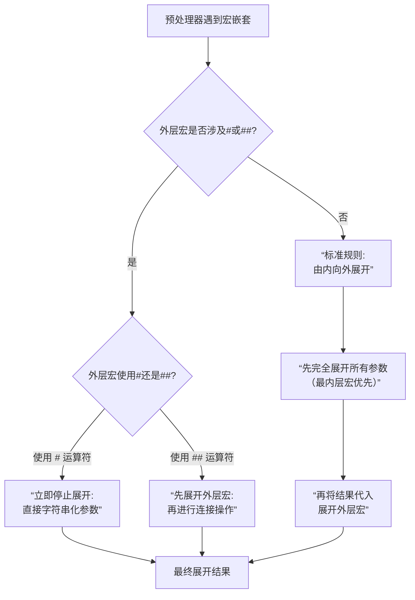

# C语言知识点·程序结构篇

## 基础知识：

###1、if,elif,else,endif,ifdef,ifndef预编译指令。

| 预处理指令 | 核心功能简述                                                 |
| ---------- | ------------------------------------------------------------ |
| `#if`      | 如果后续的**常量表达式**结果为真（非零），则编译其控制的代码块。 |
| `#elif`    | 等同于 `else if`，用于在 `#if`或上一个 `#elif`条件不满足时，提供一个新的条件进行检查。 |
| `#else`    | 等同于 `else`，为前面所有 `#if`或 `#elif`条件都不满足的情况提供一个默认的编译分支。 |
| `#endif`   | **必须**使用的指令，用于结束一个条件编译区块。               |
| `#ifdef`   | 是 `#if defined(宏名称)`的简写，检查指定的**宏是否已被定义**，无论其值如何。 |
| `#ifndef`  | 是 `#if !defined(宏名称)`的简写，检查指定的**宏是否未被定义**。 |

#### 🎯 **基本工作原理与语法结构** ####

​	条件编译指令由预处理器处理，在正式编译前根据条件决定代码块的去留。被排除的代码块在预处理后会被直接删除，不会参与后续编译。一个完整的条件编译结构如下：

```c
#if 条件表达式1
    // 代码块1
#elif 条件表达式2
    // 代码块2
#else
    // 代码块3
#endif
```

- **`#if`、`#ifdef`、`#ifndef`** 是条件编译的起点。
- **`#elif`** 和 **`#else`** 是可选的。
- **`#endif`** 是每个条件编译块**必须**的结束标记。

#### 📝 **指令详解与使用场景** ####

**1. `#if`、`#elif`、`#else`、`#endif`**

- **`#if`**：后面跟一个**常量表达式**。预处理器会计算该表达式，若结果为真（非零），则保留`#if`到`#endif`（或`#elif`、`#else`）间的代码。 `#define VERSION 2 #if VERSION == 1    printf("Version 1\n"); #elif VERSION == 2    printf("Version 2\n"); // 这行代码将被编译 #else    printf("Unknown Version\n"); #endif`
- **`#elif`**：类似 `else if`，允许进行多个条件的判断。
- **`#else`**：类似 `else`，提供所有条件都不满足时的默认分支。
- **`#endif`**：标记条件编译块的结束。为便于阅读，常在其后加注释说明对应的起始指令，如`#endif // VERSION`。

**2. `#ifdef`与 `#ifndef`**

- **`#ifdef`**：检查宏是否已定义。**只关心是否定义，不关心宏的值**。 `#define DEBUG_MODE // 定义DEBUG_MODE宏，其值为空，但#ifdef会认为已定义 #ifdef DEBUG_MODE    printf("Debug information...\n"); // 这行代码将被编译 #endif`
- **`#ndef`**：检查宏是否未定义。常用于**防止头文件被重复包含**。 `// 在 my_header.h 头文件的开头和结尾 #ifndef MY_HEADER_H #define MY_HEADER_H // 头文件的实际内容（函数声明、宏定义等） #endif // MY_HEADER_H`

**3. `defined`运算符**

​	`defined`是一个特殊的预处理运算符，用于在 `#if`和 `#elif`中检查宏是否已定义。

- 形式：`defined(宏名称)`或 `defined 宏名称`。
- 返回值：若宏已定义，返回 `1`；否则返回 `0`。
- 优势：可在逻辑表达式中组合多个条件。 `#if defined(DEBUG) && !defined(SILENT_MODE) // 检查DEBUG已定义且SILENT_MODE未定义    printf("Debug mode is on.\n"); #endif``#if defined(MACRO)`与 `#ifdef MACRO`功能相同，但 `defined`运算符能实现更复杂的条件判断。

#### ⚠️ **注意事项** ####

1. **表达式必须是常量**：`#if`和 `#elif`后的表达式只能包含**整型常量**、**字符常量**以及**已定义的宏**。不能使用变量，因为预处理发生在编译之前。 `#define COUNT 10 #if COUNT > 5 // 正确：COUNT是已定义的宏 // ... #endif int x = 10; #if x > 5 // 错误：x是变量，无法在预处理阶段求值 // ... #endif`
2. **未定义的标识符被视为0**：在 `#if`表达式中，任何不是宏的标识符都会被当作 `0`处理。 `#if UNDEFINED_MACRO // 如果UNDEFINED_MACRO未定义，则该条件等价于 #if 0 // ... #endif`
3. **`#ifdef`/`#ifndef`只检查定义与否**：它们不关心宏的具体值，只要宏被`#define`过（即使值为空或0），`#ifdef`就为真，`#ifndef`为假。
4. **慎用有副作用的宏参数**：在宏定义中，若参数在替换列表中多次出现，当宏的参数是带有副作用（如`a++`）的表达式时，可能导致预期之外的行为。条件编译指令本身不直接涉及此问题，但这是编写宏时需警惕的。

#### 💡 **主要应用场景** ####

- **调试代码**：通过定义`DEBUG`宏来控制调试信息的输出。
- **跨平台开发**：根据不同的平台宏（如`_WIN32`、`__linux__`）编译不同代码。
- **软件功能定制**：通过定义不同的宏，为不同版本编译包含不同功能的代码。
- **防止头文件重复包含**：使用`#ifndef`或`#pragma once`避免头文件内容被多次插入。


###2、typedef对各种复杂数据类型的命名格式。

​	`typedef`能为复杂类型声明创建一个清晰易用的别名，尤其是指针、数组和函数指针这类容易混淆的类型。

| 复杂数据类型                   | 变量声明示例           | 对应的typedef写法                  | 使用别名定义变量                              |
| ------------------------------ | ---------------------- | ---------------------------------- | --------------------------------------------- |
| **普通指针**                   | `int *p;`              | `typedef int* PINT;`               | `PINT p1, p2;`(p1, p2都是整型指针)            |
| **数组指针**（指向数组的指针） | `int (*p)[10];`        | `typedef int (*P_TO_ARR)[10];`     | `P_TO_ARR pArr;`(pArr指向一个含10个int的数组) |
| **函数指针**                   | `int (*pf)(int, int);` | `typedef int (*P_FUNC)(int, int);` | `P_FUNC pf1, pf2;`(pf1, pf2是同类型函数指针)  |
| **指针数组**（存放指针的数组） | `int *arr[10];`        | `typedef int* PTR_ARR[10];`        | `PTR_ARR arr;`(arr是含10个整型指针的数组)     |
| **多级指针**                   | `int **pp;`            | `typedef int** PPINT;`             | `PPINT pp;`(pp是整型的二级指针)               |


---

## 答疑：

###1、如何区分宏名里面的字母是宏名的一部分，还是宏名对应函数的变量？

​	核心在于**宏名和参数列表的书写格式**。下面这个表格总结了最关键的区分点。

| 区分要点     | 宏名的一部分                      | 宏的参数（变量）                      |
| ------------ | --------------------------------- | ------------------------------------- |
| **位置**     | 紧跟在 `#define`之后              | 位于宏名之后的括号 `( )`内            |
| **语法角色** | 代表整个替换体的名字              | 替换体中的占位符，将被实参替换        |
| **示例**     | `#define MAX(a, b) ...`中的 `MAX` | `#define MAX(a, b) ...`中的 `a`和 `b` |

**关键语法规则与技巧**

1. **宏名与括号之间无空格** 这是最重要的语法规则。**宏名和紧随其后的左括号 `(`之间绝对不能有空格**。如果出现空格，编译器会认为空格后的所有内容（包括括号）都是宏体的一部分，而不是参数列表。 **正确示例**：`#define MAX(a,b) ((a) > (b) ? (a) : (b))`。这里 `MAX`是宏名，`(a,b)`是参数列表。 **错误示例**：`#define MAX (a,b) ((a) > (b) ? (a) : (b))`。这里 `MAX`被定义成了字符串 `(a,b) ((a) > (b) ? (a) : (b))`，完全失去了带参数的功能。
2. **参数是宏体中的占位符** 在宏定义中，参数（如 `a`和 `b`）只是一个**占位符**。预处理器进行的是简单的文本替换，它会用你调用宏时提供的实际参数（实参）来替换宏体中所有对应的形参。例如，对于 `#define SUB(a,b) a-b`，语句 `result = SUB(一0, 3);`会被替换为 `result = 一0 - 3;`。
3. **利用命名习惯区分** 虽然不是强制语法，但良好的编程习惯能极大提高代码可读性。通常，**宏名全部使用大写字母，单词间用下划线 `_`连接**；而**参数名则使用小写字母**。例如： `cc下载复制运行#define CALCULATE_AREA(width, height) ((width) * (height))`在这个例子里，一眼就能看出 `CALCULATE_AREA`是宏名，而 `width`和 `height`是参数。

**易错点**

​	带参数的宏定义在预处理阶段进行的是==直接的文本替换==，编译器不会对其中的参数进行类型检查。这与函数调用不同，函数调用时编译器会检查实参和形参的类型是否匹配。这也是为什么建议在某些场景下用函数代替宏的原因之一。


###2、下面四个结论,正确的是___________________。
**A.格式一中的文件名能带路径,而格式二不能**
**B.格式一中的文件名不能带路径,而格式二可以**
**C.如果被包含文件在当前目录下,两种格式都能用**
**D.如果文件名中不带路径,格式一能搜索当前目录和编译环境指定的标准目录,而格式二不行**

```c
#include "文件名"	//格式一
#include <文件名>	//格式二
```

| 选项                                                         | 正确性 | 简要原因                                                     |
| :----------------------------------------------------------- | :----- | :----------------------------------------------------------- |
| A. 格式1中的文件名能带路径，而格式2不能                      | ❌ 错误 | 两种格式都允许文件名带路径（如`#include"dir/file.h"`或`#include<dir/file.h>`），路径处理取决于编译器设置，并非格式2不能带路径。 |
| B. 格式1中的文件名不能带路径，而格式2可以                    | ❌ 错误 | 同上，两种格式都可以带路径，所以这个说法不对。               |
| C. 如果被包含文件在当前目录下，两种格式都能用                | ❌ 错误 | 格式1会优先搜索当前目录，能找到文件；但格式2通常只搜索编译器的标准目录，除非当前目录被添加到标准路径中，否则可能找不到当前目录下的文件。因此“都能用”不准确。 |
| D. 如果文件名中不带路径，格式1能搜索当前目录和编译环境指定的标准目录，而格式2不行 | ✅ 正确 | 格式1的搜索顺序是：先当前目录，再标准目录；格式2只搜索标准目录，不搜索当前目录。这正好描述了标准行为。 |


###3、为什么双引号内的宏名不会进行替换？

​	简单来说，C语言的预处理器在处理代码时，有一条明确的规则：**对于出现在双引号内的宏名，不会进行宏替换**。这是C语言标准的规定。

​	虽然基本原则是双引号内不替换，但有一些相关的技巧值得了解：

- **字符串自动连接**：C语言编译器会将紧邻的多个字符串常量自动连接成一个。这允许你巧妙地构造字符串：

````c
#define WORLD "World" printf("Hello " WORLD "!\n"); // 输出：Hello World!
````

​	这里，`WORLD`在双引号外，所以被正常替换，然后三个字符串 `"Hello "`、`"World"`、`"!\n"`被连接起来。

- **使用 `#`运算符**：在带参数的宏中，可以使用 `#`运算符将一个宏参数直接转换为字符串字面量。这可以绕过双引号内不替换的限制：

  ```c
  #define PRINT_VAR(x) printf("The value of " #x " is %d\n", x) int age = 18;
  PRINT_VAR(age); // 输出：The value of age is 18
  ```


​	这里的 `#x`将参数 `age`转换成了字符串 `"age"`。


### 4、此处的___________________可以是：

**A. define或include**
**B. ifdef或include**
**C.ifdef或ifndef或define**
**D.ifdef或ifndef或if**

C语言提供的预处理功能包括条件编译，其基本形式为:

```c
# _____ 标记符
	程序段一
#else
	程序段2
#endif
```

- **A. define或include**：`#define`用于宏定义，`#include`用于文件包含，它们都不是条件编译指令，不能与`#else`和`#endif`搭配使用。所以这个选项错误。
- **B. ifdef或include**：`#ifdef`是条件编译指令（检查宏是否定义），但`#include`不是，因此这个选项不全面，错误。
- **C. ifdef或ifndef或define**：`#ifdef`和`#ifndef`都是正确的条件编译指令（分别检查宏是否定义或未定义），但`#define`是宏定义指令，不用于条件编译，所以这个选项错误。
- **D. ifdef或ifndef或if**：这个选项完全正确！因为：`#ifdef 标记符`：如果`标记符`已定义，则编译程序段1，否则编译程序段2。`#ifndef 标记符`：如果`标记符`未定义，则编译程序段1，否则编译程序段2。`#if 表达式`：如果`表达式`为真（非零），则编译程序段1，否则编译程序段2（这里的`标记符`可以理解为表达式）。


### 5、在程序编译时是以 _____________________ 为单位进行编译的。

​	这道题的正确答案是：**编译单元** 或 **翻译单元**。在程序编译过程中，编译器并不是一次性处理所有源代码文件，而是**以单个源文件（如 `.c`文件）及其所包含的头文件（`.h`）组成的独立模块为单位进行编译的**。这个独立的模块就称为“编译单元”或“翻译单元”。

1. **预处理**：首先，预处理器处理一个源文件（如 `main.c`），将其包含的头文件内容展开，处理宏定义和条件编译，生成一个完整的、独立的中间文件。
2. **编译**：接着，编译器将这个处理后的中间文件（即一个编译单元）编译成目标文件（如 `main.obj`或 `main.o`），其中包含的是机器代码和符号表。
3. **链接**：最后，链接器将项目中所有编译单元生成的目标文件以及所需的库文件链接在一起，生成最终的可执行程序。


### 6、C语言中，typedef与define有什么异同？

​	在C语言中，`typedef`和 `#define`虽然都能用于定义别名，但它们在本质和使用上存在关键差异。

| 特性         | `#define`                                          | `typedef`                        |
| ------------ | -------------------------------------------------- | -------------------------------- |
| **处理阶段** | 预处理器（编译前）                                 | 编译器（编译时）                 |
| **本质**     | 简单的文本替换                                     | 为已有类型定义新名称（类型别名） |
| **类型检查** | 无，不安全                                         | 有，提供类型安全                 |
| **指针操作** | 容易出错（例如定义多个指针变量）                   | 符合预期                         |
| **作用域**   | 从定义点直到文件结束（或`#undef`），不受作用域限制 | 遵循变量作用域规则（如块作用域） |
| **分号使用** | 末尾**不需要**分号                                 | 末尾**必须**有分号               |

**深入理解关键区别**

1. **指针定义的陷阱** 这是两者最经典的差异之一。由于 `#define`是简单的文本替换，在定义多个指针变量时会导致意外结果。 
```c
typedef char* PSTR; #define PCHAR char* PSTR s1, s2;  // 正确：s1和s2都是char*类型指针。
PCHAR s3, s4; 			// 陷阱：被展开为 char* s3, s4; 只有s3是指针，s4是char类型的字符！
```
2. **与`const`结合使用的困惑** 当与`const`一起使用时，`typedef`定义的类型别名会作为一个整体被`const`修饰，而`#define`的替换可能会改变预期的常量性。 
```c
typedef char* PSTR; #define PCHAR char* const PSTR p1; 
				// p1本身是常量指针，等价于 char* const p1; （指针不可改，指向的内容可改）
const PCHAR p2; // 被展开为 const char* p2; （指针可改，指向的内容不可改）
```
3. **处理复杂类型的能力** `typedef`能够优雅地简化复杂类型（如函数指针、数组指针）的声明，而`#define`难以实现。 
```c
								// 为一个函数指针类型（返回int，接受int和char*参数）定义别名 
typedef int (*pFun)(int, char*); 	// 声明一个包含5个该函数指针的数组
pFun a[5]; 							// 使用#define几乎无法以如此清晰的方式完成
```

**适用场景**

- **使用 `typedef`的场景**： **定义平台无关的类型**（如 `typedef long double REAL;`），便于移植。 **简化复杂的结构体、枚举或联合体标签**，使代码更简洁（如 `typedef struct { ... } Node;`，之后可直接用 `Node`声明变量）。 **简化复杂的类型声明**，如函数指针、数组指针等。 **需要类型安全和对指针进行别名定义时**。
- **使用 `#define`的场景**： **定义常量**（如 `#define MAX_SIZE 100`）。 **定义宏函数**（需谨慎使用括号防止优先级错误）。 **进行条件编译**（与 `#ifdef`, `#ifndef`配合）。

**注意事项**

- **语法细节**：`#define`末尾不需要分号，而 `typedef`需要。
- **存储类关键字**：`typedef`在语法上被视作存储类关键字（如 `static`, `extern`），因此不能与其他存储类关键字同时使用，如 `typedef static int INT2;`是错误的。

**总结**

​	简单来说，**`typedef`创建的是类型安全的“别名”，而 `#define`进行的是无脑的“文本替换”**。在大多数需要为类型（特别是复杂类型和指针）定义别名的场合，**应优先使用 `typedef`**，因为它更安全、更直观。而 `#define`则在定义常量和宏函数方面不可替代。理解它们的差异，能帮助写出更健壮、易维护的代码。


### 7、这句话如何理解？

> “当与`const`一起使用时，`typedef`定义的类型别名会作为一个整体被`const`修饰，而`#define`的替换可能会改变预期的常量性”。

💡 **核心区别**

- **`typedef`**：为类型定义一个新名字。当与 `const`结合时，`const`修饰的是这个**类型别名本身**。
- **`#define`**：在编译前进行简单的文本替换。当与 `const`结合时，替换后的结果决定了 `const`到底修饰谁。

📝 **代码示例**

```c
#include <stdio.h>
typedef char* pstr;   // 定义类型别名 pstr 为 char*
#define PCHAR char*   // 定义宏 PCHAR 为 char*

int main() {
    char a = 'A';
    char b = 'B';
    const pstr p1 = &a; // p1 是一个指针常量（指针本身只读）
    const PCHAR p2 = &a; // p2 是一个指向常量的指针（指向的数据只读）
    
    // 尝试修改指针的指向
    // p1 = &b;   // 错误！p1 本身是常量，不能改变指向。
    p2 = &b;      // 正确！p2 本身可以改变指向。

    // 尝试修改指针所指向的内容
    *p1 = 'X';    // 正确！p1 指向的数据可以被修改。
    // *p2 = 'Y'; // 错误！p2 指向的数据是常量，不可修改。
    return 0;
}
```

🔍 **原因分析**

- **对于 `const pstr p1`（`pstr`是 `typedef`定义的）**： `pstr`作为一个完整的类型（`char*`），`const`直接修饰这个类型。所以，`p1`是一个**指针常量**，即指针本身的指向不可变，但指向的数据可变。==这等价于 `char* const p1`。==
- **对于 `const PCHAR p2`（`PCHAR`是 `#define`定义的）**： 预处理器会先进行文本替换，将代码变为 `const char* p2`。此时，==`const`修饰的是 `char`（它左边的类型）==，所以 `p2`是一个**指向常量的指针**，即指针本身可以改变指向，但它指向的数据不可变。


###8、（追问）这句话中的const与pstr与char*修饰顺序是怎么样的？

> `pstr`作为一个完整的类型（`char*`），`const`直接修饰这个类型。所以，`p1`是一个**指针常量**，即指针本身的指向不可变，但指向的数据可变。这等价于 `char* const p1`。

| 声明方式                                | 等效声明          | `const`修饰对象    | 指针指向可否变 | 指向的数据可否变 |
| --------------------------------------- | ----------------- | ------------------ | -------------- | ---------------- |
| `const pstr p1;`(pstr 为 `char*`的别名) | `char* const p1;` | **指针 `p1`本身**  | **不可变**     | **可变**         |
| `const char* p2;`                       | `char const* p2;` | **指针指向的数据** | **可变**       | **不可变**       |

#### 💡 修饰顺序的核心规则 ####

​	上面表格中的差异，主要源于两条核心规则的交织作用。

1. **`typedef`的“原子性”或“封装性”** 

   ​	这是最关键的一点。当你使用 `typedef`为 `char*`定义了别名 `pstr`后，`pstr`在编译器眼中就是一个**完整的、不可分割的原子类型**。因此，`const pstr p1;`的含义是：`p1`是一个类型为 `pstr`的常量。既然 `pstr`就是 `char*`，那么 `p1`自然就是一个常量指针，即 `char* const p1`。编译器不会将 `const`和 `pstr`拆开再与 `char*`进行组合。

2. **`const`的“就近原则”与“左定值右定向”**

   ​	当没有 `typedef`干扰，直接面对基础类型和指针时，判断 `const`修饰谁有一个广泛使用的经验法则：**左定值，右定向**。这里的“左”和“右”是相对于星号 `*`而言的。 `const char* p`或等价的 `char const* p`：`const`在 `*`的**左边**，它修饰的是指针指向的**值**不可变。 `char* const p`：`const`在 `*`的**右边**，它修饰的是指针**本身**的指向不可变。 对于 `const pstr p1`，由于 `typedef`的原子性，`pstr`作为一个整体类型，`const`直接修饰变量 `p1`，其效果等同于 `char* const p1`，符合“右定向”的规则。


### 10、可以在全局变量定义时赋值吗？

#### 💡 全局变量与数组的初始化 ####

​	**全局变量**（包括全局数组）是可以在定义时进行初始化的，这也是推荐的做法。

- **初始化方式**：==你可以使用等号 =为其赋予一个初始值。==
- **默认值**：如果你在定义全局变量时没有显式地初始化它，C语言编译器会自动将其初始化为一个“零值”。例如，整型变量会被初始化为0，浮点型为0.0，指针为NULL。
- **重要限制**：用于初始化**全局变量**的值必须是**常量表达式**。这意味着这个值必须在编译阶段就能被确定下来，不能是函数调用、其他变量等需要在运行时计算的值。

​	对于**全局数组**，初始化方式同样灵活：

- **完全初始化**：`int globalArray[5] = {1, 2, 3, 4, 5};`
- **部分初始化**：如果提供的初始值个数少于数组大小，剩余的元素会被自动初始化为0。例如：`int globalArray[5] = {1, 2}; // 数组内容为 [1, 2, 0, 0, 0]`。
- **自动确定大小**：可以省略数组大小，编译器会根据初始值的个数自动确定：`int globalArray[] = {1, 2, 3}; // 数组大小被确定为3`。

#### ⚠️ 定义后的赋值操作 ####

​	这是问题的关键，也是初学者容易混淆的地方。

- **在函数外部（全局作用域）**：==**不可以**在定义变量或数组的语句之后，再使用单独的赋值语句。==这是因为在全局作用域，==C语言只允许进行变量的**定义**和**初始化**，而**赋值**是一种必须在函数内部执行的**操作**。== 你代码中的错误 `'func' does not name a type`正是由于在函数外写了 `func[1][109]=1;`这样的赋值语句。编译器试图将其解释为一个新的类型声明，但 `func`不是一个合法的类型名，因此报错。
- **在函数内部（局部作用域）**：**可以**对全局变量或数组元素进行赋值。一旦进入 `main`或任何其他自定义函数，你就可以自由地修改全局变量的值。


### 预编译指令elif允许出现在else之后吗？if，elif，else允许出现在endif之后吗？

​	关于C/C++预处理器中条件编译指令的组合规则，核心答案是：**`#elif`不允许出现在 `#else`之后；而 `#if`、`#elif`、`#else`必须在与它们配对的 `#endif`之前，`#endif`之后可以开始新的条件编译块。**

| 疑问点                  | 是否允许？ | 核心规则与解释                                               |
| ----------------------- | ---------- | ------------------------------------------------------------ |
| `#elif`在 `#else`之后   | **不允许** | **`#else`必须是条件编译块中的最后一个分支指令**。它表示“所有其他情况”，后面只能跟 `#endif`来结束整个条件块。 |
| 指令出现在 `#endif`之后 | **允许**   | **`#endif`只用于结束它所属的那个条件编译块**。在此之后，完全可以开始一个全新的、独立的 `#if`/`#ifdef`条件编译块。 |

**详细解释与正确语法结构**

1. **完整的条件编译块结构** 一个标准的条件编译块遵循严格的“if-else if-else”逻辑，其语法结构如下： `#if 或 #ifdef 或 #ifndef [条件1]    // 代码块1 #elif [条件2]  // 可以有0个、1个或多个#elif    // 代码块2 #else         // 最多只能有一个#else，且必须在#endif之前    // 代码块3 #endif        // 必须的结束标记`预处理器会**从上到下顺序评估**`#if`和`#elif`的条件，选择第一个为真的条件对应的代码块进行编译。如果所有条件都不为真，则编译`#else`块。如果连`#else`也没有，则整个块内的代码都会被跳过。
2. **条件编译的嵌套** 条件编译指令支持嵌套使用。内层的条件编译块必须被完整地包含在外层某个条件的代码块中。 `#if defined(PLATFORM_WINDOWS)    // Windows平台相关代码    #if _DEBUG        printf("Windows Debug Mode\n");    #else        printf("Windows Release Mode\n");    #endif #elif defined(PLATFORM_LINUX)    // Linux平台相关代码 #else    // 其他平台代码 #endif`在这个例子中，内层的 `#if _DEBUG ... #endif`被完整地包含在外层 `#if defined(PLATFORM_WINDOWS)`的代码块内，这是完全正确的。

**一个正确的代码示例**

```c
#define VERSION_LEVEL 2

int main() {
    // 正确的条件编译块示例
    #if VERSION_LEVEL == 1
        printf("Running version 1.\n");
    #elif VERSION_LEVEL == 2
        printf("Running version 2.\n"); // 这行代码将被编译
    #elif VERSION_LEVEL == 3
        printf("Running version 3.\n");
    #else
        printf("Running an unknown version.\n");
    #endif // 正确的结束

    // 在 #endif 之后，可以开始一个新的、独立的条件编译块
    #ifdef DEBUG
        printf("Debug information...\n");
    #endif

    return 0;
}
```


### 如果存在多层宏嵌套，则编译顺序是怎样的？



这个流程的核心在于预处理器如何根据宏定义中是否包含 `#`或 `##`运算符来调整展开顺序。

### 📝 关键规则与示例 ###

1. **标准情况：由内而外** 当宏定义中**不包含 `#`或 `##`** 时，预处理器会**先展开参数，再展开宏本身**。这类似于函数调用时先计算参数值。 
```c
#define MULTIPLY(x, y) (x * y) 
#define ADD(a, b) (a + b) 
#define VALUE 5 
int result = MULTIPLY(ADD(2, VALUE), 3);  
// 1. 展开最内层参数: VALUE -> 5, 得到 MULTIPLY(ADD(2, 5), 3) 
// 2. 展开参数 ADD(2, 5): ADD(2, 5) -> (2 + 5) -> 7, 得到 MULTIPLY(7, 3) 
// 3. 展开外层 MULTIPLY(7, 3): -> (7 * 3) 
// 最终结果: int result = (7 * 3);
```
2. **遇到 `#`：停止展开，直接字符串化** `#`运算符将宏参数转换为字符串。当预处理器发现参数将被字符串化时，它会**停止展开该参数**，直接将其名称（及可能存在的括号等）转为字符串 。 
```c
3. #define TO_STRING(x) 
4. #x #define VALUE 100 
5. const char* str = TO_STRING(VALUE); 
6. // 因为 TO_STRING 使用了 #，参数 VALUE 不会被展开为 100 
7. // 直接字符串化: #VALUE -> "VALUE" 
8. // 最终结果: const char* str = "VALUE";
```
3. **遇到 `##`：先展开宏，再连接符号**。 `##`运算符用于连接符号。规则是：**先展开外层宏，再进行连接操作** 。
```c
#define CONCAT(a, b) a##b 
#define VAR_NAME xx 
#define NUM 1 
int xx1 = 100; 
int val = CONCAT(VAR_NAME, NUM); 
// 1. 先展开 CONCAT 宏: 参数 VAR_NAME 和 NUM 先不展开，直接代入得到 VAR_NAME##NUM 
// 2. 连接操作: VAR_NAME##NUM -> 生成新符号 VAR_NAMENUM 
// 3. 尝试展开新符号 VAR_NAMENUM (但此符号未定义，通常会导致编译错误或非预期结果) // 注意：此处意图可能是连接展开后的值，但直接使用 CONCAT 无法实现。
```

### 💡 实用技巧：中间层宏 ###

​	为了解决 `##`连接时参数不先展开的问题，一个常见的技巧是引入一个**中间层宏**。这个中间层宏**不使用 `#`或 `##`**，从而迫使参数先按标准规则展开，然后再进行连接 。

```c
#define _CONCAT(a, b) a##b  // 实际执行连接的宏
#define CONCAT(a, b) _CONCAT(a, b) // 中间层，迫使参数先展开
#define VAR_NAME xx
#define NUM 1

int xx1 = 100;
int val = CONCAT(VAR_NAME, NUM);
// 1. 展开 CONCAT(VAR_NAME, NUM): 参数先展开，VAR_NAME -> xx, NUM -> 1, 得到 _CONCAT(xx, 1)
// 2. 展开 _CONCAT(xx, 1): 执行连接，xx##1 -> xx1
// 3. 最终结果: int val = xx1; (即100)
```

### ⚠️ 注意事项 ###

- **编译器差异**：虽然C标准定义了宏展开的基本规则，但不同编译器在处理某些复杂嵌套时，细节上可能存在差异。编写跨平台代码时，对复杂宏进行测试是明智之举 。
- **宏名破坏**：在宏展开过程中，如果生成的符号组合意外地形成了一个有效的宏名，预处理器会尝试继续展开它，这可能导致非预期的结果 。


###为何定义过一次的变量可以在不同范围内再次定义，但变量未必需要同时声明和定义？

​	定义过一次的变量可以在不同范围再次定义，关键在于“范围”是否重叠。**在不同作用域（如不同函数内）可以定义同名变量**；但在**同一作用域或嵌套作用域中，不允许重复定义**。

​	**声明和定义是两种不同的操作**。声明是告知编译器变量的存在和类型，不分配内存；定义是创建变量并分配内存。变量可以先声明（如使用`extern`），再在别处定义。

#### 🔍 深入理解作用域与重复定义 ####

“不同范围”在C语言中通常指**不同的作用域**。作用域决定了标识符（如变量名）在程序中的可见范围。

- **允许的情况：不同作用域** 在不同的函数内部，或者在不同的代码块（由 `{}`包围）内，你可以定义同名的变量，它们互不干扰。 

- ```c
  #include <stdio.h> 
  void func1() 
  {    
      int a = 10; // 作用域在 func1 内    
      printf("func1: %d\n", a); 
  } 
  void func2() 
  {    
      int a = 20; // 作用域在 func2 内，与 func1 中的 a 无关    
      printf("func2: %d\n", a); 
  } 
  int main() 
  {    
      func1(); // 输出 func1: 10    
  	func2(); // 输出 func2: 20    
      return 0; 
  }
  ```

  

- **禁止的情况：同一作用域** 在同一个函数或代码块内，不能定义两个同名的变量。 

- ```c
  void example() 
  {    
      int a = 10;    // int a = 20; 
      // 错误！在同一函数作用域内重复定义变量a 
  }
  ```

  

- **特殊情况：嵌套作用域** 当内层代码块（如`if`语句、循环内部）定义了与外层同名的变量时，内层变量会**遮蔽**外层变量。内层操作不影响外层变量，这并非重复定义。 

- ```c
  #include <stdio.h> 
  int main() 
  {    
      int a = 10; // 外层变量a    
      {        
          int a = 20; 
          // 内层变量a，遮蔽了外层的a        
          printf("内层 a = %d\n", a); 
          // 输出 20    
      }    
      printf("外层 a = %d\n", a); // 输出 10    
      return 0; 
  }
  ```

  

#### 💡 声明与定义的区别及正确用法 ####

将变量的声明和定义分离是C语言模块化编程的重要技巧，尤其是在多个源文件需要共享同一个全局变量时。

- **声明 (Declaration)**：使用 `extern`关键字。它告诉编译器“这个变量在其他地方被定义了，这里只是先打个招呼，类型无误即可”。声明可以出现多次。 `// 在头文件（如 globals.h）或源文件顶部 extern int global_var; // 声明全局变量global_var，但不分配内存`
- **定义 (Definition)**：为变量分配实际的内存空间。定义只能有一次。 `// 在某个源文件（如 main.c）中 int global_var = 100; // 定义并初始化全局变量global_var`

**最佳实践示例**：

假设有一个全局变量需要在多个文件共享：

1. **在头文件中声明** (`config.h`)： `#ifndef CONFIG_H #define CONFIG_H extern int g_log_level; // 声明 #endif`
2. **在某个源文件中定义** (`config.c`)： `#include "config.h" int g_log_level = 1; // 定义（只能在一处）`
3. **在其他源文件中使用** (`main.c`)： `#include "config.h" #include <stdio.h> int main() {    printf("Log level: %d\n", g_log_level); // 使用声明的全局变量    return 0; }`


###为何全局变量与局部变量在声明与定义上存在差异？

​	全局变量和局部变量在声明与定义上确实存在差异，这主要是由它们的作用域和内存管理方式决定的。

| 特性               | 局部变量                             | 全局变量                                     |
| ------------------ | ------------------------------------ | -------------------------------------------- |
| **作用域**         | 函数或代码块内部                     | 整个程序（从定义处开始）                     |
| **内存与生命周期** | 函数调用时在栈上创建，调用结束即释放 | 程序启动时在静态存储区创建，程序结束才释放   |
| **声明与定义**     | **通常必须合并**（`int a;`）         | **可以分离**（用`extern`声明，在另一处定义） |

#### 💡 为何有这种差异？ ####

关键在于编译器需要如何“看到”变量。

- **对于局部变量**：它的生命周期仅限于特定的函数或代码块。编译器在处理这个代码块时，需要立刻知道这个变量的所有信息（类型、名字），以便在栈上为其分配内存。因此，声明和定义必须在代码块内同时完成，无法拆分。
- **对于全局变量**：它的生命周期贯穿整个程序，并且可能被多个源文件共享。使用 `extern`关键字进行声明，其实是向编译器**承诺**：“这个变量已经在程序中的某个地方被定义了，请你相信我，先让我在这里使用它，链接时再去找它的确切位置。” 这使得模块化编程成为可能，你可以在一个源文件（如 `main.c`）中定义全局变量，在另一个源文件（如 `helper.c`）中通过 `extern`声明来使用它。

#### 🔧 关于`static`关键字 ####

`static`关键字会改变全局变量的“可见性”。用`static`修饰的全局变量，其作用域被限制在**定义它的文件内部**，无法通过`extern`在其他文件中使用。这有助于提高模块化和封装性。

💎 **简单来说**

可以这样理解：**局部变量是“临时工”，招之即来，挥之即去，所以手续简单，定义即用。全局变量是“固定资产”，需要全局协调和长期管理，因此规则更复杂，允许声明和定义分离以适应模块化开发的需要。**


---

## 代码实例：

### 1、执行以下代码后变量i的值应为__________________。

```c
#define MA(x,y) ( x*y )
i=5;
i=MA(i,i+1)-7
```

**正确答案：** `19`

**解题思路：**

- 宏 `MA(x, y)`是简单的文本替换，定义为 `(x*y)`。注意，宏参数没有用括号单独保护，因此替换时需考虑运算符优先级。
- 展开 `MA(i, i+1)`：替换为 `(i * i+1)`。由于乘法和加法的优先级，乘法先计算，即 `i * i`先于 `+1`。
- 代入 `i=5`：计算 `5 * 5 + 1 = 25 + 1 = 26`。
- 然后计算 `26 - 7 = 19`，所以最终 `i`的值为 `19`。


###2、为什么如下的结构体定义会出错？

```c
typedef struct node {
    char s[60];
    node *next[N]; // 编译器报错：未知的类型名'node'
    int occupy;
} node;
```

**错误原因**：在结构体`node`的定义内部，编译器在解析到成员`node *next[N]`时，`typedef`创建的`node`别名还未生效。此时编译器只认识`struct node`，而不认识`node`这个类型名。

**正确写法**：在结构体内部需要自引用时，应使用带`struct`关键字的结构体标签。


###3、（追问）为什么如下的代码会出错？

```c
typedef struct {
    char *pItem;
    pNode pNext; // 错误：pNode 未定义
} *pNode;
```

**错误原因**：此代码试图在定义结构体的同时，为其指针类型创建别名`pNode`。但类型别名`pNode`直到结构体定义结束才存在，因此在结构体内部成员声明`pNode pNext`时，编译器无法识别`pNode`。

**正确写法**：将结构体标签、类型别名和指针别名分开定义。

```c
// 先声明结构体标签和指针类型
typedef struct tagNode *pNode;
// 再定义结构体，内部使用已定义的pNode
struct tagNode {c
    char *pItem;
    pNode pNext;
};
// 最后为结构体本身创建别名（如果需要）
typedef struct tagNode node;
```


