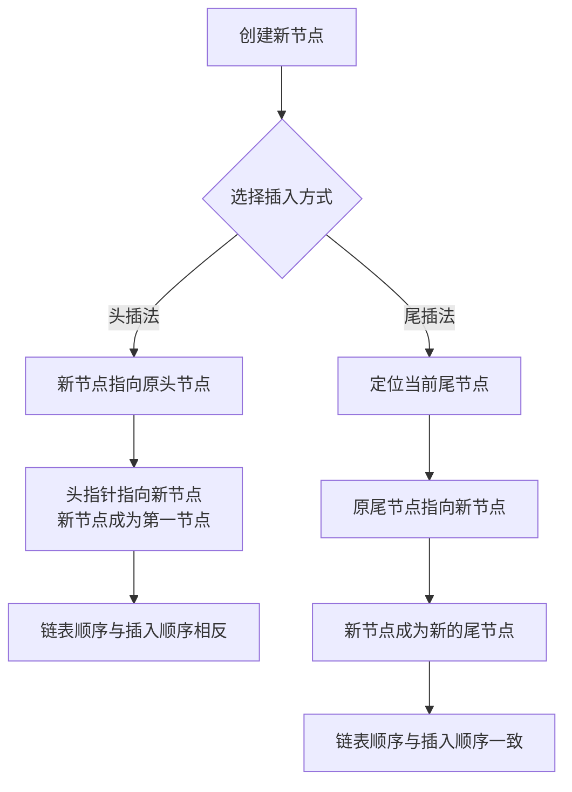

# C语言知识点·链表篇

## 基础知识：

###1、什么是头节点？

​	头节点是链表中的一个特殊节点，它位于链表的第一个数据节点（首元节点）之前，其数据域通常不存储实际业务数据，指针域则指向首元节点。

| 概念         | 描述                                                         | 是否必需           |
| :----------- | :----------------------------------------------------------- | :----------------- |
| **头节点**   | 链表的第一个节点**之前**附设的一个节点，数据域通常无意义，可存放链表长度等信息。**非必需**。 | 否                 |
| **首元节点** | 链表中第一个存储**实际数据元素**的节点。                     | 是（有数据的链表） |
| **头指针**   | 指向链表**第一个节点**（可能是头节点，或无头链表时的首元节点）的指针。**必需**。 | 是                 |

#### 💡 头节点的作用 ####

​	头节点虽然不存储实际数据，但它能带来不少便利：

1. **统一操作逻辑，简化代码**：这是头节点最重要的作用。在没有头节点的链表中，在链表首部插入或删除首元节点是特殊情况，需要单独处理（比如修改头指针的指向）。有了头节点，**所有位置的插入和删除操作都可以用统一的逻辑处理**，因为链表的第一个数据节点（首元节点）前面始终有一个头节点，算法编写更简单，可读性更强。
2. **统一空表与非空表的处理**：无论链表是否为空（即是否存在首元节点），头指针始终指向头节点。这样，对空链表（仅有头节点）和非空链表的操作（如插入、删除、遍历）在基础逻辑上是一致的，减少了条件判断。


### 2、链表的组成。

| 组成部分   | 功能描述                                                   |
| :--------- | :--------------------------------------------------------- |
| **数据域** | 存储该结点实际的数据元素。                                 |
| **指针域** | 存储下一个结点（即**直接后继**）的内存地址。               |
| **头指针** | 指向链表中第一个结点（首元结点）的指针，是访问链表的起点。 |
| **尾结点** | 链表的最后一个结点，其指针域为 `NULL`，表示链表结束。      |


### 3、头插法和尾插法。




---

## 答疑：

### 1、以下说法正确吗？

>  链表是动态存储分配的数据结构。根据需要动态地开辟内存空间，可以比较自由方便地插入新元素（结点)，支持随机访问，故使用链表可以节省内存，操作效率高。

​	关于这个说法的准确性，其描述有正确的地方，但也存在一个关键的错误。

| 特性                  | 说法是否正确？ | 详细解释                                                     |
| :-------------------- | :------------- | :----------------------------------------------------------- |
| **动态存储分配**      | **正确**       | 链表的大小不是固定的，可以在程序运行时根据需要动态地申请和释放内存空间，避免了数组需要预先指定大小的局限性。 |
| **自由插入/删除结点** | **基本正确**   | 在已知插入/删除位置的前驱结点时，链表的这些操作确实非常高效（时间复杂度为O(1)），因为不需要移动其他元素，只需修改指针。 |
| **支持随机访问**      | **错误**       | 这是说法中最不准确的一点。**链表不支持随机访问**。要访问链表中第i个元素，必须从头结点开始，沿着指针链一个一个地遍历，直到找到目标位置，平均时间复杂度为O(n)。而数组才支持通过下标直接访问元素。 |
| **节省内存**          | **视情况而定** | 链表在**存储空间利用上更灵活**，需要多少就用多少，不会像静态数组那样可能分配过多用不上的空间。但每个结点除了存储数据（数据域），还需额外存储指向下一个结点的指针（指针域），这带来了一定的**空间开销**。因此，是否更节省内存需结合具体数据大小和结点结构来评估。 |
| **操作效率高**        | **不全面**     | 这个说法过于笼统。链表的优势在于**插入和删除效率高**，但劣势在于**访问（查找）效率低**。所以，不能简单地说其所有操作效率都高，它的效率高低严重依赖于具体的操作场景。 |


### 3、链表中的元素可以通过索引访问吗？

​	关于“链表中的元素可以通过索引访问”这个说法，**并不完全正确**。严格来说，链表不支持像数组那样的**真正意义上的索引随机访问**。

| 特性           | 链表                                                         | 数组                                                         |
| :------------- | :----------------------------------------------------------- | :----------------------------------------------------------- |
| **内存布局**   | 非连续。节点分散在内存中，通过指针连接。                     | 连续。元素在内存中顺序紧密排列。                             |
| **访问方式**   | **顺序访问**。必须从**头节点**开始，沿着指针链一个节点一个节点地遍历，直到找到目标位置。 | **随机访问**。通过**索引**（即内存地址的偏移量）可直接计算出任何元素的位置并访问。 |
| **时间复杂度** | O(n)。最坏情况下需要遍历整个链表。                           | O(1)。无论数组多大，访问任何索引的元素都几乎是瞬间完成的。   |


###4、在单向链表中，存储每个结点需有两个域，一个是数据域，另一个是指针域，它指向该结点的（ ）。
**A.直接前趋**	**B.直接后继**

**C.开始结点**	**D.终端结点**

在单向链表中，每个结点的指针域指向该结点的**直接后继**。

| 选项术语        | 中文常称               | 含义解析                                                     |
| :-------------- | :--------------------- | :----------------------------------------------------------- |
| **A. 直接前趋** | 直接前驱               | 指在逻辑顺序上，**紧挨在该结点之前**的那个结点。例如，在序列 (A, B, C) 中，A 是 B 的直接前驱结点。 |
| **B. 直接后继** | 直接后继               | 指在逻辑顺序上，**紧挨在该结点之后**的那个结点。同样是序列 (A, B, C)，C 就是 B 的直接后继结点。 |
| **C. 开始结点** | 开始结点（或首元结点） | 指的是链表中**第一个存储有效数据**的结点。在有头结点的链表中，它是头结点后面的第一个结点；在没有头结点的链表中，它自己就是链表的起点。 |
| **D. 终端结点** | 终端结点（或尾结点）   | 指的是链表中**最后一个**结点。它的指针域不指向任何结点，通常被设置为 **NULL** 或一个特殊标记，表示链表在此结束。 |

💡 **核心考点与延伸理解**

- **单向链表的特性**：在单向链表中，每个结点都像一串珍珠中的一颗，除了自身承载数据（数据域），只通过一根“线”（指针域）连接着**下一颗珍珠**（直接后继）。它无法直接知道上一颗珍珠是谁（直接前驱），这也是单向链表和双向链表最主要的区别。
- **与双向链表的区别**：如果是双向链表，每个结点就会有两个指针域，分别指向它的直接前驱和直接后继。但题目明确是**单向链表**，所以答案非常明确。


### 6、如果节点p=NULL，那么p->next会报错还是返回NULL？

​	如果节点指针 `p`为 `NULL`，那么访问 `p->next`**会导致程序报错（运行时错误）**，而不是返回 `NULL`。这是因为在C语言中，**解引用一个空指针（即访问 `p->next`相当于 `(*p).next`）是未定义行为（undefined behavior）。**最常见的后果是程序崩溃，例如触发**“段错误”（segmentation fault）**或**“访问冲突”（access violation）**，具体错误信息取决于操作系统和编译器。


### 7、下列关于链表的说法正确的是（	） ###

**A.链表中的每个元素都有一个指向下一个元素的指针**
**B.链表中的元素可以是任意类型的数据**
**C.链表中的每个元素都有一个指向前一个元素的指针**
**D.链表中的元素必须是连续存储的**

| 选项 | 说法                                         | 正确性   | 说明                                                         |
| ---- | -------------------------------------------- | -------- | ------------------------------------------------------------ |
| A    | 链表中的每个元素都有一个指向下一个元素的指针 | **正确** | 单链表的每个节点包含数据域和指针域，指针域指向下一个节点（或NULL表示结束）。这是链表的基本结构。 |
| B    | 链表中的元素可以是任意类型的数据             | **正确** | 链表节点中的数据域可以存储任意数据类型（如整数、字符、对象等），具体类型由实现定义。 |
| C    | 链表中的每个元素都有一个指向前一个元素的指针 | **错误** | 这仅适用于双向链表（Doubly Linked List）。单链表（Singly Linked List）只有指向下一个节点的指针，没有前向指针。 |
| D    | 链表中的元素必须是连续存储的                 | **错误** | 链表节点在内存中不必连续存储，而是通过指针连接。这是链表与数组的主要区别，数组才要求连续存储。 |


---

## 代码实例：

###1、指针p、q、r分别指向一个链表中的3个连续结点。现要将q和r所指结点的先后位置交换, 同时要保持链表的连续, 以下错误的程序段是()。

```c
struct node
{   int data;
struct node *next;} *p, *q, *r;
```

**A.r->next =q; q->next =r->next; p->next =r;**

**B.q->next = r->next; p->next =r; r->next=q;**

**C.p->next=r; q->next=r->next; r->next = q;**

**D.q->next=r->next; r->next=q; p->next = r;**

| 选项  | 操作步骤 (按序执行)                                         | 每一步操作后的链表状态分析                                   | 最终结果                                         |
| :---- | :---------------------------------------------------------- | :----------------------------------------------------------- | :----------------------------------------------- |
| **A** | 1. `r->next = q;` 2. `q->next = r->next;` 3. `p->next = r;` | 第一步：`r`指向 `q`，**`r`与原后继节点的连接断开**。 第二步：`q->next`被赋值为 `r->next`（即当前指向 `q`自己），**形成 `q -> q`的循环**。 第三步：`p`指向 `r`。 | **错误**，形成循环链表，无法访问 `r`之后的节点。 |
| **B** | 1. `q->next = r->next;` 2. `p->next = r;` 3. `r->next = q;` | 第一步：`q`指向 `r`的后继，**正确保存了后续链表**。 第二步：`p`指向 `r`，将 `r`结点链接到 `p`之后。 第三步：`r`指向 `q`，完成交换。 | **正确**，交换成功，链表连续。                   |
| **C** | 1. `p->next = r;` 2. `q->next = r->next;` 3. `r->next = q;` | 第一步：`p`指向 `r`，将 `r`结点链接到 `p`之后。 第二步：`q`指向 `r`的后继，**正确保存了后续链表**。 第三步：`r`指向 `q`，完成交换。 | **正确**，交换成功，链表连续。                   |
| **D** | 1. `q->next = r->next;` 2. `r->next = q;` 3. `p->next = r;` | 第一步：`q`指向 `r`的后继，**正确保存了后续链表**。 第二步：`r`指向 `q`，建立 `r`和 `q`的连接。 第三步：`p`指向 `r`，将新的节点序列链接到 `p`之后。 | **正确**，交换成功，链表连续。                   |


###2、现有功能为创建不含有头结点的单链表，下列对函数的分析说法中正确的是（          ）

```c
typedef struct node
{
    int data;
    struct node *next;
}NODE;
NODE *creatlink(void)
{
    NODE *head=NULL; 
    NODE *pnew=NULL;
    NODE *tail=NULL;
    int count=0;
    int i;
    printf("input count:");
    scanf("%d",&count);
    for(i=1;i<=count;i++)
    {
        pnew=malloc(sizeof(NODE)) ;
        if(pnew==NULL)
        {
            printf(“申请内存失败！”) ;        
            exit(1);
        }
        pnew->next=NULL;
        scanf("%d",&pnew->data);
        if(head==NULL)
        {
            head=pnew;
        }    
        else
        {
            tail=head;    
            while(tail->next!=NULL)
                     tail=tail->next;
                tail->next=pnew;
        }
        //调整语句的位置
    }    
    return head;
}
```

A.该函数采用了尾插法创建单链表。


B.该函数采用了头插法创建单链表。


C.该函数以用户输入新增结点个数来创建单链表


D.pnew=malloc(sizeof(NODE)) ;这条语句是正确的。


E.该函数在将新结点插入到单链表时，以head是否为空作为条件分成了两类处理，其实可以省略该判定，直接将新结点插入。

F.如果调整语句pnew->next=NULL；的位置，并不会影响该函数的调用结果。

G.这几条语句的目的是让tail指向单链表的最后一个结点。

```c
        tail=head; 
        while(tail->next!=NULL)
            tail=tail->next;
```

**正确选项分析**：

- **A. 该函数采用了尾插法创建单链表。****正确**。在代码中，当链表不为空时，程序通过`tail`指针遍历到链表末尾，然后将新节点`pnew`链接到尾部（`tail->next = pnew`）。这符合尾插法的特征，即新节点总是添加到链表的尾部。
- **C. 该函数以用户输入新增结点个数来创建单链表。****正确**。函数开始时，用户输入`count`值，然后通过`for`循环执行`count`次，每次循环创建一个新节点。因此，链表节点个数由用户输入决定。
- **D. `pnew=malloc(sizeof(NODE)) ;`这条语句是正确的。****正确**。这条语句使用`malloc`动态分配内存，大小由`sizeof(NODE)`计算，符合C语言标准。虽然某些编译器可能建议添加强制类型转换（如`(NODE*)malloc(sizeof(NODE))`），但C语言中`void*`可以自动转换为其他指针类型，因此没有语法问题，不会导致错误。
- **G. `tail=head; while(tail->next!=NULL) tail=tail->next;`这几条语句的目的是让tail指向单链表的最后一个结点。****正确**。这些语句从`head`开始遍历链表，直到`tail->next`为`NULL`，此时`tail`指向链表的最后一个节点。这是尾插法中的标准操作，用于定位尾部以便插入新节点。

**错误选项分析**：

- **B. 该函数采用了头插法创建单链表。****错误**。头插法是将新节点插入链表头部，但本函数中，新节点总是添加到尾部（通过`tail`指针）。当链表为空时，新节点成为`head`，但这只是初始化，并非头插法。因此，B不正确。
- **E. 该函数在将新结点插入到单链表时，以head是否为空作为条件分成了两类处理，其实可以省略该判定，直接将新结点插入。****错误**。判定`head`是否为空是必要的。如果省略判定，当链表为空时，直接执行`tail=head`和`while(tail->next!=NULL)`会访问空指针（`tail`为`NULL`），导致未定义行为（如程序崩溃）。因此，E不正确。
- **F. 如果调整语句`pnew->next=NULL；`的位置，并不会影响该函数的调用结果。****错误**。语句`pnew->next=NULL`确保新节点的`next`指针为`NULL`，表示它是链表的尾节点。如果调整其位置（例如移到插入操作之后），可能导致新节点的`next`指针未正确初始化，破坏链表结构（如形成循环或断裂）。因此，F不正确。


